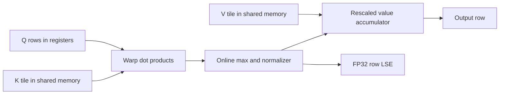

# FlashAttention CUDA from First Principles

An exact, tiled scaled-dot-product attention implementation written as a
PyTorch C++/CUDA extension. The project implements the essential
FlashAttention ideas directly—online softmax, on-chip K/V tiling, a fused
forward pass, saved row log-sum-exp statistics, and recomputation-based dQ/dK/dV
backward kernels—without calling another FlashAttention implementation.

This is a learning and systems portfolio project. It is deliberately smaller
than the production FlashAttention library: the focus is a readable, auditable
implementation of the algorithm, a strong validation harness, and reproducible
performance experiments.

> **Validation status.** The CUDA forward and first-order backward paths are
> implemented for the contract below. The environment in which this repository
> was authored does not provide PyTorch, `nvcc`, or an NVIDIA GPU, so this README
> does not invent GPU numbers or claim a successful native run. The strict
> Kaggle command `pytest -m cuda --require-cuda` is the publication gate: it
> fails instead of silently skipping when the extension or GPU is unavailable.

## What is implemented

| Capability | Status | Notes |
|---|---|---|
| Explicit PyTorch attention oracle | Implemented | Stable FP32 accumulation for FP16/BF16 inputs |
| PyTorch SDPA comparison | Implemented | Selectable reference/optimized baseline |
| Tiled CUDA forward | Implemented | No `Nq × Nk` score/probability allocation |
| Stable online softmax | Implemented | Running max, denominator, numerator, FP32 LSE |
| Causal attention | Implemented | Square self-attention |
| Non-causal cross-attention | Implemented | `Nq` may differ from `Nk` |
| First-order backward | Implemented | Streaming recomputation for dQ, dK, and dV |
| FP32 / FP16 / BF16 | Implemented | FP32 internal accumulation |
| Tile and dimension tails | Implemented | `1 <= head_dim <= 256` |
| Benchmark artifact capture | Implemented | Timestamped CSV plus environment metadata |
| Kaggle GPU runbook | Implemented | Preserves Kaggle's installed Torch/CUDA stack |
| Arbitrary masks, bias, dropout | Not supported | Causal flag only |
| GQA/MQA head broadcasting | Not supported | Q/K/V head counts must match |
| Tensor cores / async copy pipeline | Not supported | Clarity-first scalar/warp implementation |
| Second-order gradients | Not supported | Backward is marked once-differentiable |

## Why FlashAttention changes the memory behavior

For one attention head,

\[
S=\frac{QK^\mathsf{T}}{\sqrt d},\qquad
P=\operatorname{softmax}(S),\qquad
O=PV.
\]

Conventional operator-by-operator attention materializes the
`Nq × Nk` score/probability matrix in high-bandwidth memory (HBM). The arithmetic
cost is \(\Theta(N_qN_kd)\), while the intermediate storage is quadratic in
sequence length.

FlashAttention is still exact and still has quadratic arithmetic. Its central
idea is IO-aware tiling: load small K/V blocks into on-chip memory, combine them
with query rows, update a stable softmax state, and discard each temporary score
tile. The full attention matrix is never written to HBM. This distinction—less
data movement, not an approximate or subquadratic attention rule—is the key
result of [Dao et al. (2022)](https://arxiv.org/abs/2205.14135).



For a score prefix, the forward kernel maintains

\[
m=\max_j S_{ij},\quad
\ell=\sum_j e^{S_{ij}-m},\quad
A=\sum_j e^{S_{ij}-m}V_j.
\]

When a new score `x` arrives, it uses

\[
m'=\max(m,x),\quad
\ell'=e^{m-m'}\ell+e^{x-m'},\quad
A'=e^{m-m'}A+e^{x-m'}V,
\]

then writes \(O=A/\ell\) and
\(\operatorname{LSE}=m+\log\ell\). This is the online-normalizer technique of
[Milakov and Gimelshein (2018)](https://arxiv.org/abs/1805.02867), extended to
carry the value numerator. [The math note](docs/math.md) derives and proves the
streaming invariant.

## Kernel architecture

The implementation favors inspectability over peak hardware utilization:

- one 128-thread block contains four warps;
- each warp owns one query row in forward/dQ or one key row in dK/dV;
- 16 K/V rows are cooperatively staged in FP32 shared memory per forward tile;
- warp lanes own head dimensions in strides of 32, covering any `D <= 256`;
- warp shuffles reduce query/key and gradient/value dot products;
- the current PyTorch CUDA device and stream are respected;
- all flattened global-memory offsets use 64-bit integers;
- dynamic shared memory is bounded by 32 KiB at the maximum head dimension;
- `expf` is used and the build does not enable fast-math.

Backward does not save the probability matrix. It first calculates

\[
\delta_i=\langle dO_i,O_i\rangle,
\]

then recomputes
\(P_{ij}=\exp(s\langle Q_i,K_j\rangle-\operatorname{LSE}_i)\) and

\[
dS_{ij}=P_{ij}\left(\langle dO_i,V_j\rangle-\delta_i\right).
\]

A query-major kernel owns dQ rows; a key-major kernel owns dK/dV rows. This
avoids both quadratic saved state and global gradient atomics. See
[the CUDA design note](docs/design.md) for the mapping and boundary cases.

## API contract

The public entry point is `flash_attention_cuda.flash_attention`.

| Input property | Requirement |
|---|---|
| Shape | Q `[B,H,Nq,D]`; K/V `[B,H,Nk,D]` |
| Device | all tensors on the same device |
| Dtype | all tensors have the same floating dtype |
| CUDA dtype | FP32, FP16, or BF16 |
| Head dimension | native kernel supports `1..256` |
| Causal shape | requires `Nq == Nk` |
| Layout | Python accepts strided tensors and calls `.contiguous()` |
| Scale | finite float; defaults to `D**-0.5` |

`implementation` controls dispatch:

- `"cuda"` requires the compiled extension and raises a useful error otherwise;
- `"sdpa"` calls PyTorch scaled-dot-product attention;
- `"reference"` calls the explicit quadratic PyTorch oracle;
- `"auto"` uses the native kernel only when its contract is satisfied and falls
  back to SDPA otherwise.

```python
import torch

from flash_attention_cuda import flash_attention

q = torch.randn(2, 8, 1024, 64, device="cuda", dtype=torch.float16,
                requires_grad=True)
k = torch.randn_like(q, requires_grad=True)
v = torch.randn_like(q, requires_grad=True)

out = flash_attention(q, k, v, causal=True, implementation="cuda")
loss = out.float().square().mean()
loss.backward()

print(out.shape, q.grad.shape, k.grad.shape, v.grad.shape)
```

Non-causal cross-attention uses the same API:

```python
q = torch.randn(1, 8, 256, 64, device="cuda", dtype=torch.bfloat16)
k = torch.randn(1, 8, 1024, 64, device="cuda", dtype=torch.bfloat16)
v = torch.randn_like(k)
out = flash_attention(q, k, v, implementation="cuda")
assert out.shape == q.shape
```

## Build on Kaggle

Kaggle is the intended GPU validation environment. Enable a GPU accelerator
before executing any build cell. Work in `/kaggle/working`; `/kaggle/input` is
read-only.

### 1. Inspect the preinstalled environment

```bash
cd /kaggle/working/flash-attention-cuda

python - <<'PY'
import torch
from torch.utils.cpp_extension import CUDA_HOME

print("PyTorch:", torch.__version__)
print("PyTorch CUDA:", torch.version.cuda)
print("CUDA available:", torch.cuda.is_available())
print("CUDA_HOME:", CUDA_HOME)
if torch.cuda.is_available():
    print("GPU:", torch.cuda.get_device_name(0))
    print("compute capability:", torch.cuda.get_device_capability(0))
PY

nvcc --version
```

Do **not** install another PyTorch build, CUDA toolkit wheel bundle, or NVIDIA
dependency freeze over Kaggle's environment. The extension must compile against
the exact PyTorch/CUDA stack that will load it.

### 2. Install test utilities and build in place

```bash
python -m pip install -r requirements.txt
MAX_JOBS=2 python -m pip install -v -e . --no-build-isolation
```

`--no-build-isolation` is intentional: it exposes Kaggle's installed PyTorch to
the extension build. `MAX_JOBS=2` reduces peak compiler memory. PyTorch chooses
the visible GPU architecture by default; only set `TORCH_CUDA_ARCH_LIST` when
building for a known different target.

### 3. Require real CUDA validation

```bash
pytest -m "not cuda" -q
pytest -m cuda --require-cuda -q
```

The first command covers the reference/API contract. The second must compile,
import, execute, and numerically validate the custom forward and backward. With
`--require-cuda`, a missing GPU or extension is a failure, not a green skip.

If the notebook accelerator changes, remove the local `build/` directory and
the compiled extension, then rebuild. Build products are ignored by Git.

## Reference-only installation

A machine without `nvcc` can use the Python oracles and run non-CUDA tests:

```bash
FLASH_ATTENTION_SKIP_CUDA_BUILD=1 \
  python -m pip install -e '.[dev]' --no-build-isolation
pytest -m "not cuda" -q
```

This path does not validate, benchmark, or claim availability of the custom
kernel.

## Tests

The test design separates three questions:

1. **API/reference correctness:** shapes, rectangular attention, causal
   validation, scales, dtypes, input errors, and SDPA agreement on CPU.
2. **Native numerical correctness:** custom forward plus dQ/dK/dV against a
   high-confidence PyTorch reference for causal/non-causal FP32/FP16/BF16,
   sequence and dimension tails, non-contiguous inputs, large values, and a
   non-default stream.
3. **Availability:** an explicit strict flag prevents an absent CUDA runtime or
   missing extension from turning the native suite into a false positive.

Useful commands:

```bash
pytest -q                              # normal suite; CUDA tests may skip
pytest -m "not cuda" -q                # portable CPU/API suite
pytest -m cuda --require-cuda -q       # mandatory Kaggle publication gate
pytest -m cuda -k backward -q          # focus on native gradients
```

FP16/BF16 calculations are compared with dtype-aware tolerances; bitwise
identity is not expected because tiled reductions reassociate floating-point
operations. PyTorch's [numerical accuracy
note](https://docs.pytorch.org/docs/stable/notes/numerical_accuracy.html)
explains why mathematically identical batched computations can differ at the
last bits.

## Benchmarks and results policy

Inspect the full CLI before a run:

```bash
python -m benchmarks.bench_attention --help
```

The benchmark records raw per-repeat latency, median and percentile summaries,
ordinary token throughput (`B × N / seconds`, not multiplied by heads), an
effective attention TFLOP/s estimate, incremental peak allocator memory,
maximum/RMS error, shape/dtype/causality, and an environment manifest including
the GPU, compute capability, PyTorch/CUDA versions, seed, timestamp, and Git
state. CUDA Events are used for GPU timing.

Run a small correctness-first sweep before long sequences:

```bash
python -m benchmarks.bench_attention \
  --seq-lens 128 512 \
  --head-dims 64 \
  --dtypes float32 float16 \
  --causal both \
  --output-dir results/runs
```

Then expand the sequence/head-dimension matrix only after the strict CUDA suite
passes. OOMs are data points and should be retained, not silently discarded.

The checked-in `results/benchmark_baseline.csv` is a historical CPU baseline
from before the native implementation. It is not evidence of custom-kernel
speed. [The benchmark protocol](docs/benchmarks.md) defines the comparison and
the evidence required before GPU values may be promoted to this README or the
report.

## Technical report

`report/` contains a cited LaTeX report and result template designed to compile
to roughly 30–40 substantive pages. It includes the attention derivation,
online-softmax proof, IO model, CUDA mapping, backward derivation, validation
methodology, benchmark design, limitations, and reproducibility appendices.
Future-result boxes are visibly marked; no GPU values are fabricated.

```bash
cd report
latexmk -pdf main.tex
```

If `latexmk` is unavailable:

```bash
pdflatex main.tex
bibtex main
pdflatex main.tex
pdflatex main.tex
```

LaTeX build products are ignored. Review `report/README.md` before replacing any
pending-result box.

## Repository map

```text
flash_attention_cuda/
├── __init__.py              Public exports
├── attention.py             Dispatch and custom autograd Function
└── reference.py             Explicit PyTorch and SDPA oracles

src/
├── attention_cuda.cpp       PyBind boundary and input validation
├── attention_kernel.cu      Forward, delta, dQ, and dK/dV CUDA kernels
└── attention_naive.py       Compatibility import for the old module path

tests/                       CPU/API and strict CUDA correctness suites
benchmarks/                  Reproducible CLI benchmark and artifact writer
results/                     Curated baseline; raw runs are ignored
docs/
├── math.md                  Derivations and numerical model
├── design.md                Thread/block/shared-memory architecture
└── benchmarks.md            Measurement and reporting protocol
report/                      30–40-page LaTeX technical report/template
```

The requested local continuity files `context.md` and `how__to_run.md` are
present in this workspace but intentionally ignored. They contain no public
claims that are absent from this README.

## Known limitations and interpretation

- This implementation is exact in real arithmetic, but not bitwise identical
  to every PyTorch SDPA backend.
- FP32 shared tiles favor clarity and numerical behavior over bandwidth and
  occupancy.
- Fixed `4 × 16` row tiling is not tuned per head dimension or GPU generation.
- Scalar FP32 dot products do not use tensor cores.
- Backward recomputation performs extra arithmetic to avoid quadratic state.
- The native operator is restricted to `D <= 256` and equal Q/K/V head widths.
- Only causal or fully dense non-causal attention is available.
- Native compilation and GPU runtime behavior must be verified on Kaggle before
  performance conclusions are published.
- Passing correctness tests does not establish freedom from all race or bounds
  bugs; run NVIDIA Compute Sanitizer for a release-quality evaluation.

These boundaries are part of the project, not hidden deficiencies. They make
it possible to reason about every operation and provide concrete directions for
future vectorized loads, tensor-core fragments, architecture-specific tile
specialization, asynchronous pipelines, dropout, mask/bias support, and GQA.

## Core sources

- Vaswani et al., [Attention Is All You
  Need](https://papers.nips.cc/paper_files/paper/2017/hash/3f5ee243547dee91fbd053c1c4a845aa-Abstract.html),
  NeurIPS 2017.
- Dao et al., [FlashAttention: Fast and Memory-Efficient Exact Attention with
  IO-Awareness](https://proceedings.neurips.cc/paper_files/paper/2022/hash/67d57c32e20fd0a7a302cb81d36e40d5-Abstract.html),
  NeurIPS 2022.
- Dao, [FlashAttention-2: Faster Attention with Better Parallelism and Work
  Partitioning](https://arxiv.org/abs/2307.08691), ICLR 2024.
- Milakov and Gimelshein, [Online Normalizer Calculation for
  Softmax](https://arxiv.org/abs/1805.02867), 2018.
- Rabe and Staats, [Self-attention Does Not Need
  O(n²) Memory](https://arxiv.org/abs/2112.05682), 2021.
- Goldberg, [What Every Computer Scientist Should Know About Floating-Point
  Arithmetic](https://doi.org/10.1145/103162.103163), 1991.
- [PyTorch scaled-dot-product attention
  documentation](https://docs.pytorch.org/docs/stable/generated/torch.nn.functional.scaled_dot_product_attention.html).
- [NVIDIA CUDA Programming
  Guide](https://docs.nvidia.com/cuda/cuda-programming-guide/) and [Best
  Practices Guide](https://docs.nvidia.com/cuda/cuda-c-best-practices-guide/).

The report bibliography adds the IO-complexity, roofline, framework, profiling,
and newer FlashAttention references with full citation metadata.

## License

MIT. See [LICENSE](LICENSE).
